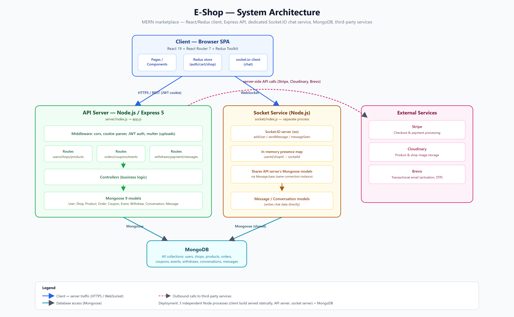

# E-Shop

A multi-vendor e-commerce marketplace (MERN stack) — buyers browse and buy from independent seller shops, sellers run their own storefronts, and admins oversee the platform.



## Monorepo layout

This repo is three independently run Node.js services plus the client build:

| Directory | What it is | Docs |
|---|---|---|
| [`client/`](client) | React 19 + Redux Toolkit SPA (storefront, seller dashboard, admin dashboard) | [client/README.md](client/README.md) |
| [`server/`](server) | Express 5 REST API (auth, products, orders, payments, admin) | [server/README.md](server/README.md) |
| [`socket/`](socket) | Standalone Socket.IO service for real-time buyer↔seller chat | — |

The socket service shares the API server's MongoDB/Mongoose connection to persist chat messages, but runs as its own process on its own port — see the diagram above.

## Features

- **Storefront** — categories, featured products, flash-sale events, cart, wishlist
- **Auth** — separate buyer/seller/admin sessions with JWT cookies and email activation (Brevo)
- **Checkout** — Stripe PaymentIntents, server-side price verification, webhook-driven order fulfillment
- **Orders** — per-shop order pipeline with automatic seller payout on delivery
- **Seller tools** — product & event management, coupons, withdrawal requests, shop settings
- **Admin dashboard** — manage users, sellers, products, orders, events, withdrawals
- **Real-time chat** — buyer↔seller messaging over Socket.IO

## Tech stack

- **Client:** React 19, Vite, Redux Toolkit, React Router 7, Tailwind CSS v4
- **API:** Express 5, Mongoose 9, JWT, Multer + Cloudinary, Stripe, Brevo
- **Realtime:** Socket.IO
- **Database:** MongoDB

## Getting started

Each service has its own `package.json`, `.env`, and install step. You need all three running for the full app:

```bash
# 1. API server (http://localhost:5000)
cd server
npm install
npm run dev

# 2. Socket service (http://localhost:4000)
cd socket
npm install
npm run dev

# 3. Client (http://localhost:5173)
cd client
npm install
npm run dev
```

See [server/README.md](server/README.md) and [client/README.md](client/README.md) for required environment variables and the dev seed script.

## Architecture

- The client talks to the API server over HTTPS/REST (JWT in an httpOnly cookie) and to the socket service over WebSocket.
- The API server owns all business logic and data access: `routes → controllers → Mongoose models`.
- The socket service handles only presence and message delivery; it writes chat messages straight to MongoDB via the API server's shared Mongoose models.
- The API server calls out to Stripe (payments), Cloudinary (image uploads), and Brevo (transactional email).

Full diagram: [docs/architecture-diagram.png](docs/architecture-diagram.png).
